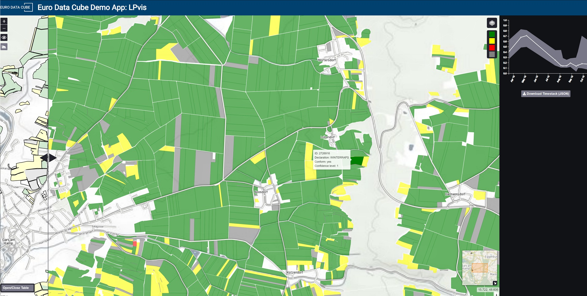

# Project

[Demonstrator deployed on EOxHub](https://lpvis-0652eab6-e5d0-11e9-a359-2a2ae2dbcce4.edc.hub.eox.at)

This is a **fork** of the 

LPvis 🕺
> Pronounce: "Elpvis" | FOSS Webapp for LPIS declaration conformity assessment and validation of ML classification results

[demo project](https://github.com/EOX-A/LPvis) with the goal to extend the capabilities of the (UI only) prototype with concrete backend functionality:

- connect to [EDC Sentinel Hub](https://eurodatacube.com/marketplace?group=Euro%20Data%20Cube) service to retrieve NDVI timestacks for a concrete LPIS parcel

- apply a trained Crop-Type classification ML as derived via [EDC LPIS Use-case](https://eurodatacube.com/marketplace/notebooks/contributions/EDC_Usecase-LPIS_Crop-Type-Classification.ipynb) on agricultural parcels within a small sample region in Austria

- use Crop-Type predictions as stored in [EDC GeoDB](https://eurodatacube.com/marketplace/services/eurodatacube-geodb) to visualize "declaration" vs "classification result" for LPIS parcels


## Prerequisites

- LPIS/IACS data - i.e. agricultural parcel boundaries as well as farmer crop type declararation - are ingested in Euro Data Cube - geoDB vector databases: this has been done with open government data of Austria for the years 2016, 2017, 2018

- Euro Data Cube - geoDB data is exposed as vector tile layer: we decided to export static vector tiles from geoDB and bundle them together with the application for this demo, uploading these files to S3 or syncing geoDB to PostGIS to be [served directly](https://info.crunchydata.com/blog/dynamic-vector-tiles-from-postgis) would be more scalable options. In order to be able to reproduce the vector tile creation preprocessing a jupyter notebook was added: [a link](https://github.com/eurodatacube/LPvis/blob/master/geodata/create_vector_tiles.ipynb)

- a validated dataset of farmer declarations of 2018 is used to train a Crop-Type classification ML on a sample region, this model is applied to a larger region based on NDVI timestacks for 2018 and stored back in Euro Data Cube - geoDB

**Note:** the trained ML model uses Crop-Type groups (like `Sommergetreide`) and not concrete Crop-Types (like `ZuckerMais`, `Hirse`), a mapping table was used for traffic light visualization (e.g. `green` = farmers Crop-Type declaration matches predicted Crop-Type group with prediction model accuracy > 95%)



## Important

The current backend implementation requires EDC service subscriptions to retrieve NDVI timestacks and to handle LPIS/IACS data as well as Crop-Type predictions.

In order to run the app as in the demo, the following environment variables have to be applied to the Docker container:
```
# for EDC Sentinel Hub
SH_CLIENT_ID=
SH_CLIENT_SECRET=
# for EDC GeoDB
GEODB_API_SERVER_URL=
GEODB_AUTH_CLIENT_ID=
GEODB_AUTH_CLIENT_SECRET=
GEODB_AUTH_AUD=
GEODB_API_SERVER_PORT=
GEODB_AUTH_DOMAIN=
# for Crop-Type model
use GEODB_MODEL_ID=1
```
